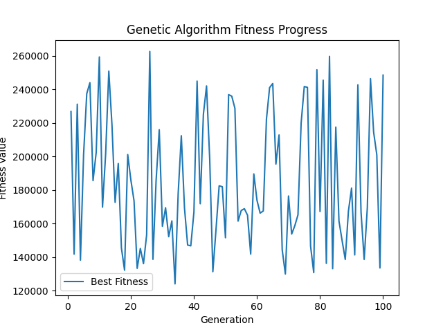

# Генетический алгоритм и Q-обучение в управлении технологическим процессом

## Описание

Этот репозиторий содержит решение кейса по управлению технологическим процессом с использованием генетического алгоритма и Q-обучения. Кейс включает в себя моделирование процесса и оптимизацию распределения серий по печам для достижения максимальной эффективности.

## Структура репозитория

- `src/` - исходный код программы на Python
- `image/` - изображения с результатами
- `json_results/` - JSON-файлы с результатами генетического анализа и Q-обучения
- `requirements.txt` - файл с зависимостями Python
- `README.md` - описание проекта

## Как использовать

1. Установите необходимые зависимости с помощью `pip install -r requirements.txt`.
2. Запустите файл `src/main.py` для выполнения генетического алгоритма и Q-обучения.
3. Результаты будут сохранены в папках `images/` и `json_results/`.

## Результаты

### Генетический алгоритм

- График эффективности: 
- Тепловая карта загрузки печей: 
- График моделирования процесса: 
- Результаты генетического анализа: [json_results/genetic_algorithm_results.json](json_results/results.json)

### Q-обучение (с RL)

- График эффективности: 
- Тепловая карта загрузки печей: 
- График моделирования процесса: 
- Результаты Q-обучения: [json_results/q_learning_results.json](json_results/q_learning_results.json)
